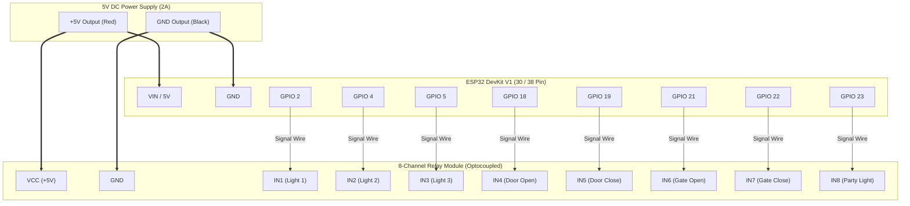
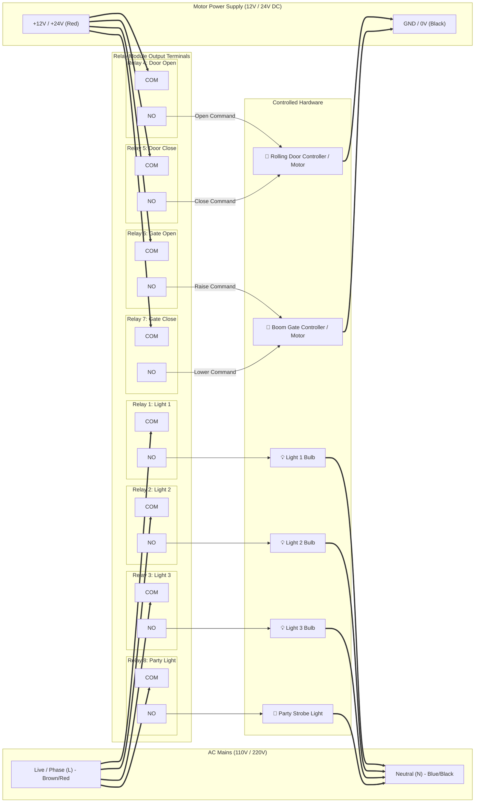

# Detailed ESP32 Hardware Wiring & Circuit Guide

---

## 1. Low-Voltage Signal Wiring (ESP32 to Relay Module)

---

## 2. High-Voltage / Appliance Wiring (Relay Terminals to Loads)

---

## 3. Terminal Connection Pin-by-Pin Table

| Component | ESP32 Pin | Relay Input | Relay Output Terminals | Load Connection |
|---|:---:|:---:|:---:|---|
| **Light 1** | `GPIO 2` | `IN 1` | `COM 1` ➔ AC Live `NO 1` ➔ Light 1 (L) | Light 1 (N) ➔ AC Neutral |
| **Light 2** | `GPIO 4` | `IN 2` | `COM 2` ➔ AC Live `NO 2` ➔ Light 2 (L) | Light 2 (N) ➔ AC Neutral |
| **Light 3** | `GPIO 5` | `IN 3` | `COM 3` ➔ AC Live `NO 3` ➔ Light 3 (L) | Light 3 (N) ➔ AC Neutral |
| **Rolling Door (Open)** | `GPIO 18` | `IN 4` | `COM 4` ➔ Motor DC (+) `NO 4` ➔ Door Open wire | Door Controller Common ➔ DC (-) |
| **Rolling Door (Close)** | `GPIO 19` | `IN 5` | `COM 5` ➔ Motor DC (+) `NO 5` ➔ Door Close wire | Door Controller Common ➔ DC (-) |
| **Boom Gate (Open)** | `GPIO 21` | `IN 6` | `COM 6` ➔ Gate DC (+) `NO 6` ➔ Gate Open wire | Gate Controller Common ➔ DC (-) |
| **Boom Gate (Close)** | `GPIO 22` | `IN 7` | `COM 7` ➔ Gate DC (+) `NO 7` ➔ Gate Close wire | Gate Controller Common ➔ DC (-) |
| **Party Light** | `GPIO 23` | `IN 8` | `COM 8` ➔ AC Live `NO 8` ➔ Party Light (L) | Party Light (N) ➔ AC Neutral |

---

## 4. Key Wiring Rules & Safety

> [!IMPORTANT]
> **Use Normally Open (NO) Terminals**:  
> Always connect your appliances between **COM** (Common) and **NO** (Normally Open). This ensures that if the ESP32 loses power or reboots, all lights and motors stay safely **OFF**.

> [!TIP]
> **Common Ground**:  
> The ESP32 `GND` and the Relay Board `GND` **must be connected together** to create a shared reference point for the logic signals.
