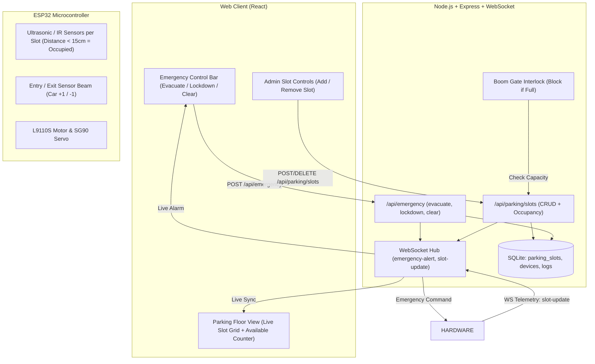

# Implementation Plan: Emergency Protocols & Dynamic Parking Slot Management

This plan details the design and implementation for two core building management systems:
1. **Priority 1: Emergency Master Protocols** (Immediate Evacuation & Master Lockdown with full-screen alert and device overrides).
2. **Priority 2: Dynamic Parking Slot Management & ESP32 Slot Counting** (Admin can add/remove slots, ESP32 automated occupancy sensing logic, and automatic boom-gate lockout when parking is full).

---

## Proposed Architecture & Logic



---

## Feature 1: Emergency Evacuation & Master Lockdown

### Behavior:
1. **Emergency Evacuation Mode**:
   - Immediately commands the **Rolling Door** to open and **Boom Gate** to open.
   - Turns **all lights** ON for safe egress.
   - Sets emergency state in SQLite and broadcasts a high-priority `emergency-alert` (`mode: 'evacuate'`) across all connected clients.
   - Regular users see a full-width flashing emergency alert banner with a persistent alarm sound.
2. **Emergency Lockdown Mode**:
   - Immediately closes the Rolling Door and Boom Gate to secure the floor.
   - Broadcasts `emergency-alert` (`mode: 'lockdown'`).
3. **Clear Emergency**:
   - Admin can click "Clear Emergency / All Clear" to return the system to normal operation.

---

## Feature 2: Dynamic Parking Slots & ESP32 Counting Logic

### 1. Admin Dynamic Slot Management:
- Admin can **Add Parking Slots** (e.g. `Slot A1`, `Slot A2`, `Slot B1`) with assigned sensor type and GPIO pin.
- Admin can **Delete Parking Slots** when floor re-configurations occur.
- Total slots and available count update dynamically in real time (`Available: X / Y`).

### 2. ESP32 Slot Counting Logic:
We implement a dual-sensing architecture in the ESP32 firmware:
- **Approach A: Slot-level Ultrasonic / IR Obstacle Detection**:
  - Each slot can be assigned a digital/analog pin or ultrasonic pair (Trigger/Echo).
  - When a vehicle is parked over the spot (distance < 15 cm or beam interrupted), the ESP32 debounces the signal for 1.5 seconds and emits:
    ```json
    { "type": "slot-update", "slotId": "slot-1", "occupied": true }
    ```
- **Approach B: Gate Passage / Optical Beam Fallback**:
  - Entry and exit trigger sensors before and after the boom gate track incoming and outgoing vehicles to maintain a global floor count even if not all physical slots have individual sensors wired.
- **Auto-Gate Full Capacity Interlock**:
  - When all parking slots are occupied (`available === 0`), the Boom Gate card shows a **"PARKING FULL"** status.
  - If a user attempts to open the boom gate, the backend rejects it with **400 Bad Request** (`"Parking floor is at maximum capacity (0 slots available)"`), preventing unauthorized entry until a vehicle vacates. Admin accounts retain manual override capability.

---

## Proposed Changes

### Database Layer

#### [MODIFY] [`server/src/database.js`](file:///Users/hakk/Documents/Coding/web/car_parking_web/server/src/database.js)
- Add `parking_slots` table:
  ```sql
  CREATE TABLE IF NOT EXISTS parking_slots (
      id TEXT PRIMARY KEY,
      name TEXT NOT NULL,
      sensor_pin TEXT DEFAULT '',
      sensor_type TEXT DEFAULT 'ultrasonic',
      occupied INTEGER DEFAULT 0,
      updated_at DATETIME DEFAULT CURRENT_TIMESTAMP
  );
  ```
- Add `system_state` table or key-value settings for `emergency_mode` (`normal`, `evacuate`, `lockdown`).
- Seed 4 default slots (`Slot A1`, `Slot A2`, `Slot A3`, `Slot A4`).

---

### Backend API & WebSocket Layer

#### [NEW] [`server/src/routes/emergency.js`](file:///Users/hakk/Documents/Coding/web/car_parking_web/server/src/routes/emergency.js)
- `GET /api/emergency` - Current emergency state.
- `POST /api/emergency/evacuate` (Admin / Authorized) - Trigger emergency evacuation.
- `POST /api/emergency/lockdown` (Admin only) - Trigger lockdown.
- `POST /api/emergency/clear` (Admin only) - Reset to normal.

#### [NEW] [`server/src/routes/parking.js`](file:///Users/hakk/Documents/Coding/web/car_parking_web/server/src/routes/parking.js)
- `GET /api/parking/slots` - Get all slots, total, occupied, available count.
- `POST /api/parking/slots` (Admin only) - Create slot (name, pin, sensor_type).
- `DELETE /api/parking/slots/:id` (Admin only) - Delete slot.
- `PUT /api/parking/slots/:id/status` - Toggle/update slot occupancy (used by web and ESP32 telemetry).

#### [MODIFY] [`server/src/routes/devices.js`](file:///Users/hakk/Documents/Coding/web/car_parking_web/server/src/routes/devices.js)
- In the Boom Gate open route (`PUT /api/devices/boom-gate`), add capacity check:
  - If target state is `open`, check available slots.
  - If available is `0` and user is not admin, reject with 400 (`Parking floor is full`).

#### [MODIFY] [`server/src/websocket.js`](file:///Users/hakk/Documents/Coding/web/car_parking_web/server/src/websocket.js)
- Broadcast `slot-update`, `slots-changed`, and `emergency-alert` events to all connected clients.
- Handle ESP32 incoming messages of type `slot-update` and `parking-counter`.

#### [MODIFY] [`server/src/server.js`](file:///Users/hakk/Documents/Coding/web/car_parking_web/server/src/server.js)
- Register `/api/emergency` and `/api/parking` routes.

---

### ESP32 Firmware

#### [MODIFY] [`esp32/floor_management_esp32.ino`](file:///Users/hakk/Documents/Coding/web/car_parking_web/esp32/floor_management_esp32.ino)
- Add ultrasonic / IR sensor reading routine with 1.5s debouncing.
- Emit WebSocket `{ "type": "slot-update", "slotId": "slot-X", "occupied": bool }`.
- Handle incoming `emergency-alert` command: immediately drive motor/servo to safe positions and flash alarm LED / buzzer.

---

### Frontend Components

#### [NEW] [`client/src/components/EmergencyBar.jsx`](file:///Users/hakk/Documents/Coding/web/car_parking_web/client/src/components/EmergencyBar.jsx)
- Top emergency control bar for Admins: **"🚨 Evacuation"**, **"🔒 Lockdown"**, **"✅ All Clear"**.
- Full-screen audible strobe warning overlay when emergency is active.

#### [NEW] [`client/src/components/ParkingFloor.jsx`](file:///Users/hakk/Documents/Coding/web/car_parking_web/client/src/components/ParkingFloor.jsx)
- Interactive visual parking floor grid displaying slot cards.
- Car graphics / icons with green (`FREE`) and red (`OCCUPIED`) glow badges.
- Occupancy meter bar: `Available: 3 / 4 Slots` and `PARKING FULL` warning tag.
- "Add Slot" button for Admins opening the configuration modal.
- "Remove Slot" action on each slot for Admins.

#### [NEW] [`client/src/components/AddSlotModal.jsx`](file:///Users/hakk/Documents/Coding/web/car_parking_web/client/src/components/AddSlotModal.jsx)
- Modal to create custom slots with name (e.g. `Slot B3`), sensor type (`Ultrasonic HC-SR04`, `IR Sensor`, `Virtual/Manual`), and GPIO pin.

#### [MODIFY] [`client/src/components/DeviceCard.jsx`](file:///Users/hakk/Documents/Coding/web/car_parking_web/client/src/components/DeviceCard.jsx)
- Update Boom Gate card to display a `PARKING FULL` badge when capacity is 0, locking the Open button with explanatory tooltip.

#### [MODIFY] [`client/src/pages/DashboardPage.jsx`](file:///Users/hakk/Documents/Coding/web/car_parking_web/client/src/pages/DashboardPage.jsx)
- Render `EmergencyBar` and `ParkingFloor` sections with real-time WebSocket listeners.

---

## Verification Plan

### Automated Tests
1. **Emergency Protocol Tests**:
   - `POST /api/emergency/evacuate`: Verify rolling door opens, boom gate opens, lights turn on, WebSocket event emitted.
   - `POST /api/emergency/lockdown`: Verify door and gate close.
   - `POST /api/emergency/clear`: Verify state returns to normal.
2. **Parking Slots CRUD & Interlock Tests**:
   - Admin creates `Slot Test-1`: Verify slot added to database and broadcast to clients.
   - Update slot occupancy to make floor 100% full (`available === 0`).
   - Normal user attempts to open Boom Gate: Verify server rejects with **400 Bad Request** (`Parking is full`).
   - Vacate one slot (`available > 0`): Verify Boom Gate can now be opened.
   - Admin deletes slot: Verify slot removed cleanly.
3. **ESP32 Telemetry Simulation**:
   - Run simulation script sending `{ type: "slot-update", slotId: "slot-1", occupied: true }` via WebSocket; verify database and frontend sync instantly.
