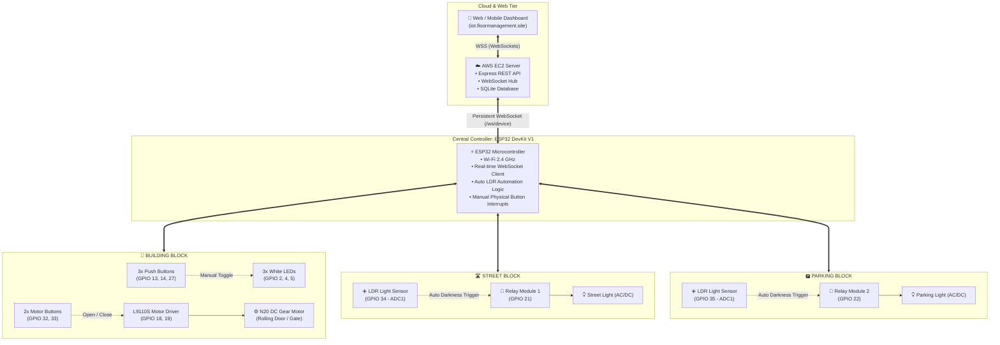
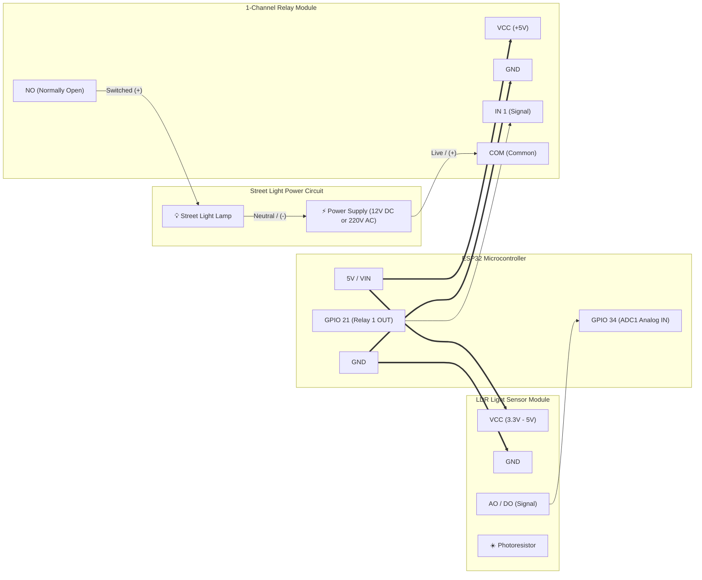
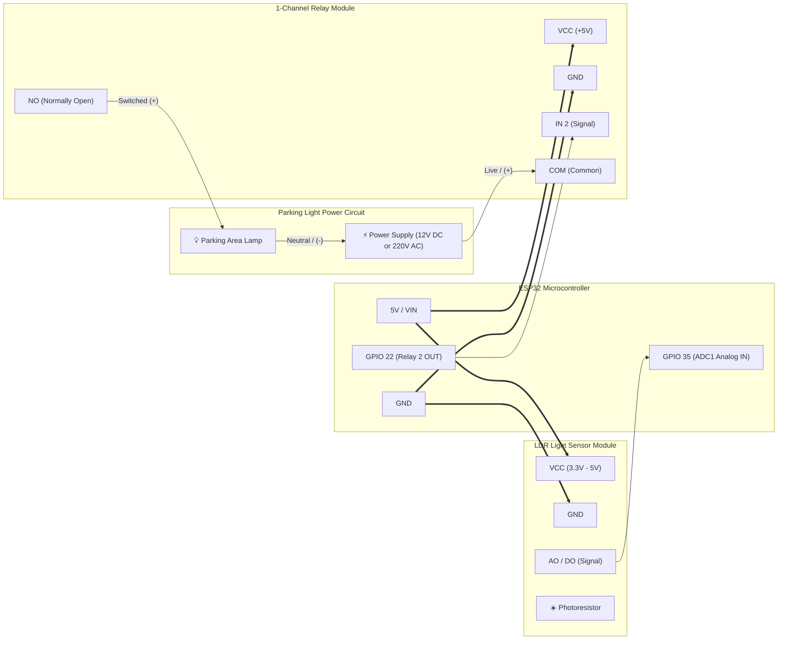

# Complete IoT Physical System & Block Wiring Diagrams

This document contains the complete system architecture and detailed per-block wiring schematics for the **Building Block**, **Street Block**, and **Parking Block**.

---

## 1. Whole System Architecture

---

## 2. Building Block (Detailed Diagram)

### Components:
* **3x White LEDs** with current-limiting resistors (220Ω - 330Ω)
* **3x Switch Buttons** (Push buttons with internal `INPUT_PULLUP`)
* **1x L9110S H-Bridge Motor Driver Module**
* **1x N20 Micro DC Geared Motor** (for door/gate)
* **2x Motor Push Buttons** (Open / Close buttons with `INPUT_PULLUP`)

```mermaid
flowchart TD
    subgraph ESP32_B["ESP32 Microcontroller"]
        GND_B["GND"]
        V33["3.3V / 5V"]
        
        P_LED1["GPIO 2 (LED 1 OUT)"]
        P_LED2["GPIO 4 (LED 2 OUT)"]
        P_LED3["GPIO 5 (LED 3 OUT)"]
        
        P_BTN1["GPIO 13 (BTN 1 IN)"]
        P_BTN2["GPIO 14 (BTN 2 IN)"]
        P_BTN3["GPIO 27 (BTN 3 IN)"]
        
        P_MOT_A["GPIO 18 (Motor IN-A / FWD)"]
        P_MOT_B["GPIO 19 (Motor IN-B / REV)"]
        
        P_BTN_OPEN["GPIO 32 (Door Open BTN)"]
        P_BTN_CLOSE["GPIO 33 (Door Close BTN)"]
    end

    subgraph LED_Circuit["3x White LEDs"]
        R1["220Ω Resistor"] --> LED1["⚪ LED 1 (Building Room 1)"] --> GND_B
        R2["220Ω Resistor"] --> LED2["⚪ LED 2 (Building Room 2)"] --> GND_B
        R3["220Ω Resistor"] --> LED3["⚪ LED 3 (Building Corridor)"] --> GND_B
    end

    subgraph Button_Circuit["3x LED Control Buttons"]
        BTN1["🔘 Button 1"]
        BTN2["🔘 Button 2"]
        BTN3["🔘 Button 3"]
    end

    subgraph Motor_Driver["L9110S Motor Driver & N20 Motor"]
        L9_VCC["VCC (+5V/6V)"]
        L9_GND["GND"]
        L9_INA["A-1A (Input A)"]
        L9_INB["A-1B (Input B)"]
        L9_OUTA["MOTOR-A (+)"]
        L9_OUTB["MOTOR-A (-)"]
        N20["⚙️ N20 DC Motor"]
    end

    subgraph Motor_Buttons["2x Motor Push Buttons"]
        BTN_OP["🔘 Button: Open Door"]
        BTN_CL["🔘 Button: Close Door"]
    end

    %% LED Connections
    P_LED1 --> R1
    P_LED2 --> R2
    P_LED3 --> R3

    %% LED Button Connections (To GND with internal PULLUP)
    P_BTN1 --- BTN1 --- GND_B
    P_BTN2 --- BTN2 --- GND_B
    P_BTN3 --- BTN3 --- GND_B

    %% Motor Driver Logic Connections
    P_MOT_A --> L9_INA
    P_MOT_B --> L9_INB
    V33 ==> L9_VCC
    GND_B ==> L9_GND

    %% Motor Output
    L9_OUTA ===> N20
    L9_OUTB ===> N20

    %% Motor Button Connections
    P_BTN_OPEN --- BTN_OP --- GND_B
    P_BTN_CLOSE --- BTN_CL --- GND_B
```

---

## 3. Street Block (Detailed Diagram)

### Components:
* **1x LDR Light Sensor Module** (with analog AO or digital DO output)
* **1x 5V Relay Module Channel**
* **1x Street Light** (12V DC or 110V/220V AC)

---

## 4. Parking Block (Detailed Diagram)

### Components:
* **1x LDR Light Sensor Module** (detects parking area ambient light)
* **1x 5V Relay Module Channel**
* **1x Parking Light** (12V DC or 110V/220V AC)

---

## 5. Master Pin Allocation Table

| Block | Device / Component | ESP32 GPIO | Pin Mode / Type | Wiring Notes |
|---|---|:---:|---|---|
| **Building** | White LED 1 | `GPIO 2` | `OUTPUT` | Connected to 220Ω resistor ➔ LED anode (+) |
| **Building** | White LED 2 | `GPIO 4` | `OUTPUT` | Connected to 220Ω resistor ➔ LED anode (+) |
| **Building** | White LED 3 | `GPIO 5` | `OUTPUT` | Connected to 220Ω resistor ➔ LED anode (+) |
| **Building** | Button 1 (LED 1) | `GPIO 13` | `INPUT_PULLUP` | Push button to `GND` |
| **Building** | Button 2 (LED 2) | `GPIO 14` | `INPUT_PULLUP` | Push button to `GND` |
| **Building** | Button 3 (LED 3) | `GPIO 27` | `INPUT_PULLUP` | Push button to `GND` |
| **Building** | L9110S Motor IN-A | `GPIO 18` | `OUTPUT` | Motor Forward / Open direction |
| **Building** | L9110S Motor IN-B | `GPIO 19` | `OUTPUT` | Motor Reverse / Close direction |
| **Building** | Motor Button (Open) | `GPIO 32` | `INPUT_PULLUP` | Push button to `GND` |
| **Building** | Motor Button (Close)| `GPIO 33` | `INPUT_PULLUP` | Push button to `GND` |
| **Street** | LDR Sensor (Street) | `GPIO 34` | `ANALOG INPUT` | Uses ADC1 (Safe with Wi-Fi enabled) |
| **Street** | Street Light Relay | `GPIO 21` | `OUTPUT` | Relay module `IN1` |
| **Parking** | LDR Sensor (Parking) | `GPIO 35` | `ANALOG INPUT` | Uses ADC1 (Safe with Wi-Fi enabled) |
| **Parking** | Parking Light Relay | `GPIO 22` | `OUTPUT` | Relay module `IN2` |
