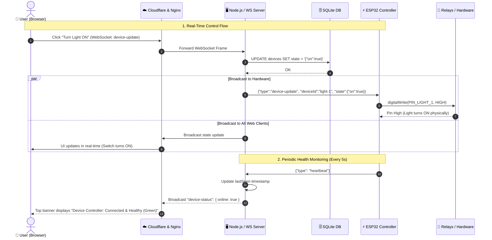
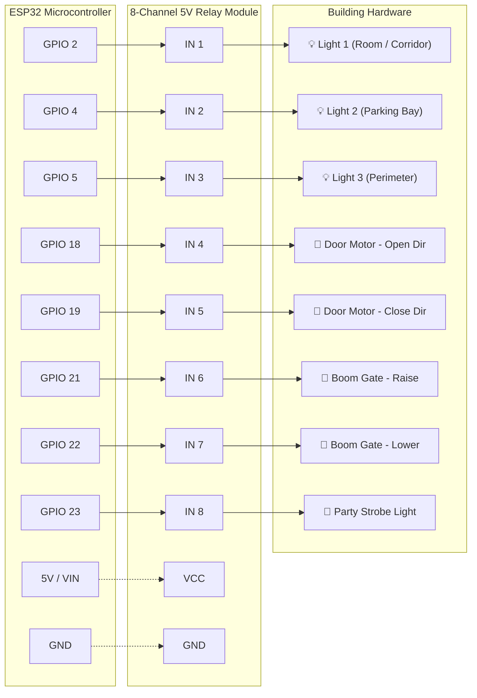

# Cotafer IoT System Architecture & Diagrams

---

## 1. High-Level System Architecture

This diagram illustrates how users, the Cloudflare edge, AWS EC2 cloud infrastructure, and the ESP32 physical microcontroller interact.

```mermaid
flowchart TB
    subgraph Clients["Clients Tier"]
        AdminUser["👤 Admin (Web / Mobile)"]
        NormalUser["👥 Users (Web / Mobile)"]
    end

    subgraph Edge["Cloudflare Edge & Security"]
        CF["☁️ Cloudflare CDN & Proxy<br/><code>iot.floormanagement.site</code><br/>• Automatic SSL/TLS (HTTPS & WSS)<br/>• DDoS Protection & DNS"]
    end

    subgraph AWS["AWS EC2 Cloud Server (Ubuntu 24.04)"]
        subgraph NginxLayer["Nginx Reverse Proxy (:80 / :443)"]
            Nginx["Nginx Web Server<br/>• Routes HTTP requests<br/>• WebSocket Upgrade (Connection: Upgrade)<br/>• Long-lived connections"]
        end

        subgraph NodeApp["Node.js Application (:5050) - Managed by PM2"]
            StaticServe["Static React Frontend<br/>(Vite build in client/dist)"]
            ExpressAPI["Express.js REST API<br/>• /api/auth (JWT)<br/>• /api/users<br/>• /api/devices"]
            WSHub["WebSocket Server (ws)<br/>• /ws (Web clients)<br/>• /ws/device (ESP32)"]
            CronEngine["Automation Engine<br/>• node-cron scheduler<br/>• Countdowns & Cycles"]
            SQLiteDB[("SQLite Database<br/><code>database.sqlite</code><br/>• Users & Passwords<br/>• Devices & GPIO Pins<br/>• Activity Logs<br/>• Automations")]
        end
    end

    subgraph Hardware["Physical Hardware Tier (Building / Facility)"]
        ESP32["⚡ ESP32 Microcontroller<br/>• Wi-Fi 2.4 GHz<br/>• WebSocket Client (arduinoWebSockets)<br/>• Heartbeat (every 5s)<br/>• JSON Parser (ArduinoJson)"]
        
        subgraph Relays["Relay Channels & Drivers"]
            R1["Relay 1 (GPIO 2)"]
            R2["Relay 2 (GPIO 4)"]
            R3["Relay 3 (GPIO 5)"]
            R4["Relay 4 & 5 (GPIO 18, 19)"]
            R6["Relay 6 & 7 (GPIO 21, 22)"]
            R8["Driver (GPIO 23)"]
        end

        subgraph Actuators["Physical Loads"]
            L1["💡 Light 1"]
            L2["💡 Light 2"]
            L3["💡 Light 3"]
            Door["🚪 Rolling Door Motor"]
            Gate["🚧 Boom Gate Motor"]
            Party["🎉 Party Light"]
        end
    end

    %% Connections
    AdminUser -->|"HTTPS / WSS"| CF
    NormalUser -->|"HTTPS / WSS"| CF
    CF -->|"HTTP / WS Proxy"| Nginx
    Nginx -->|"Proxy Pass"| NodeApp

    StaticServe -.->|"Served to"| AdminUser
    StaticServe -.->|"Served to"| NormalUser

    ExpressAPI <--> SQLiteDB
    WSHub <--> SQLiteDB
    CronEngine <--> SQLiteDB
    CronEngine -->|"Trigger Events"| WSHub

    ESP32 <==|"Persistent WebSocket<br/>(ws://.../ws/device)"| WSHub

    ESP32 --> R1 --> L1
    ESP32 --> R2 --> L2
    ESP32 --> R3 --> L3
    ESP32 --> R4 --> Door
    ESP32 --> R6 --> Gate
    ESP32 --> R8 --> Party
```

---

## 2. Real-Time Communication Sequence Diagram

This sequence diagram details what happens when a user toggles a device from the web dashboard.



---

## 3. ESP32 Hardware Wiring & Pinout Diagram


